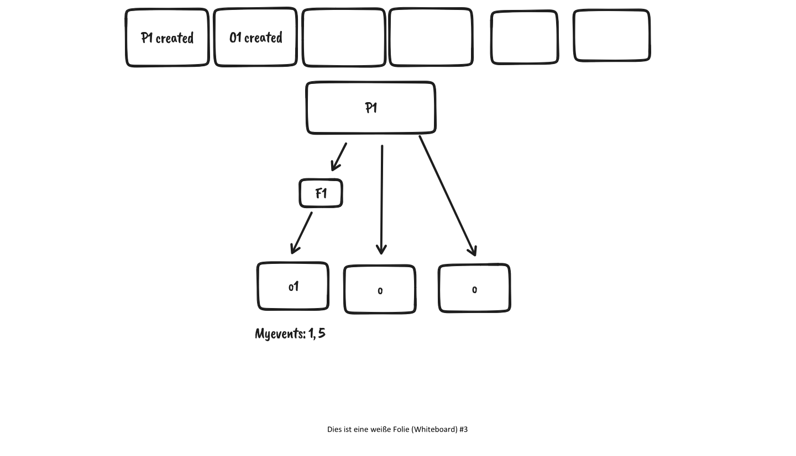

# Resources

## Aruna Instance ("Global config")

### Onboarding an aruna instance in a "dynamic" server environment

1. Create a single server (Server 1)
2. Create or automatically generate an associated keypair for Server 1 to generate a CA
3. Initialize global admin user by providing a once usable global admin password (config) to the "InitializeGlobalAdminRequest" either with a valid OIDC token or as a local user -> Responds with a GlobalAdmin Token
4. Register instances:
    1. Call "add server" endpoint (server 2) in server 1 by global admin
    2. Receive an onboarding token -> Create a sub CA
    3. Start Server 2 with server 1 and onboarding token configured
    4. repeat 2-4 for every additional server (using any of the existing servers)

### Aruna instance

1. An aruna instance is built by running 1 or more aruna servers that create a common consensus layer.
2. Aruna instances share the same user / oidc configuration and may have a common website
3. They are used to bootstrap and configure realms and endpoints
4. Instances can configure the number of realms that can be created by an individual user (All = 1, 0123ahjhasdjhasdjashdj = 5)

## Endpoints

1. Endpoints are external services that manage storage or compute infrastructure.
2. Endpoints are configured in aruna instances and can be associated with one or more realms
3. Endpoints can have a whitelist for specific realms
    1. Whitelisted endpoints can only be seen by users that have access to these realms.
    2. Endpoints without whitelist can be associated with any realm, but can limit the number of associations. e.g. max 10
4. A server generates for every token valid credentials for all endpoints specified by the realm(s)

## Realms

1. Realms are the highest organizational structure that bundle closely related domains or interestgroups together they specify domain specific rules, storage and compute locations.

2. Users can create or join a realm, when they create a new realm it automatically creates a "realm admins" group with the creating user in it, the group can not be shared and is unique to this specific realm

3. Realms can either be public or private, public realms can be seen by everyone and users can request to join this realm. Private realms are invitation only.

4. Each hierarchy resource is associated with exactly one specific realm

5. Servers can limit the number of realms created by users (The default servers limit this to 1)
6. For now: Each server can talk to each other server independent of the realm (This might change in favor of realm specific sharding in the future)

7. "GlobalAdmins" for now are associated with a server group.

## Hierarchy

Associations between node_types are constructed via edges. This includes user -> token relationsships, resources, realms etc. 

### Projects

### Folder

### Objects

## Permission

### Users

### ServiceAccounts

### Groups

### Tokens

Tokens are bound to serviceaccounts or users via an "OWNED_BY_USER" relation (idx 8). Tokens can have either "shared" permission inherited by the owner OR specific permissions to a resource or user.


# Events

## Endpoint status (events)

1. User makes an async "SyncToEndpoint" request
2. Server relays this request to the specific endpoint
3. Endpoint generates a Sync ULID 
4. Server gets the Sync ULID and responds to user
5. Endpoint starts syncing 
6. "GetSyncStatus" request -> relay to endpoint respons with status
7. If syncing is finished -> Synevi (consensus) event that includes the request + outcome
8. Triggers "regular" Event + notifications etc.


## Resource events

1. Each project has a list of all associated events
2. Each associated resource has a list of indices to project events
3. "associated events" are events that effect a specific resource (including relations) e.g. name, kvs, description etc.
4. Event Consumer -> Bound to project 
4.1 Consumer can filter to specific sub events (either a specific resource by id OR a specific resource by id including all of its children)


5. Possible struct:

```protobuf

message Consumer {
    string id = 1;
    string resource = 2;
    bool include_subresource = 3;
    // string project_id = 4;
    uint64 event_pointer = 5;
}

```
## Realmevents 

Possible Realmevents:

- Create Realm
- Update Realm (multiple)
- Add / Remove group
- Add / Remove Realmadmin ?
- Create Project
- Add / Remove Endpoint / Rule ...

## Userevents

- User created
- Added / Removed permission to group / resource / realm
- Changed userinfo (email, name, etc.)
- Added / Removed token

## Groupevents

- Added / Removed User / Serviceaccount
- Added permission to group / user / resource
- Joined / Left realm
- Created project
